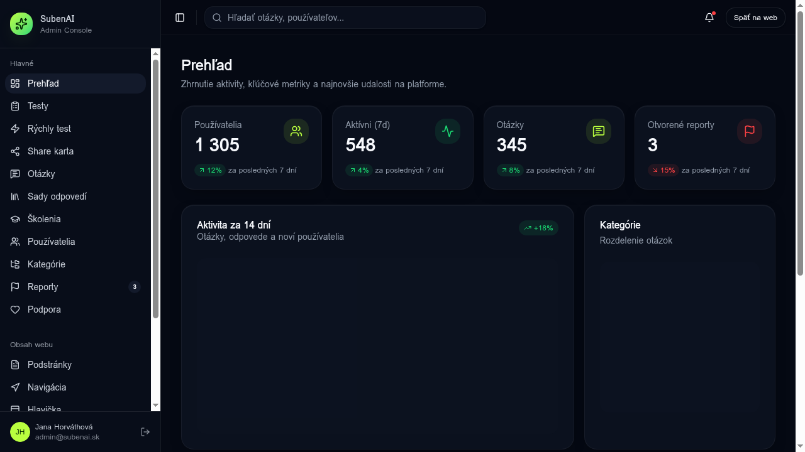
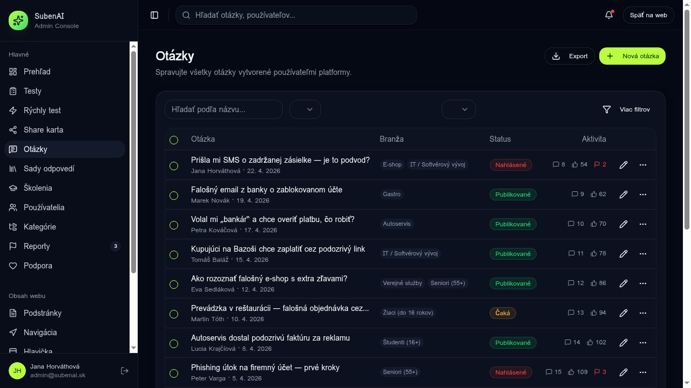
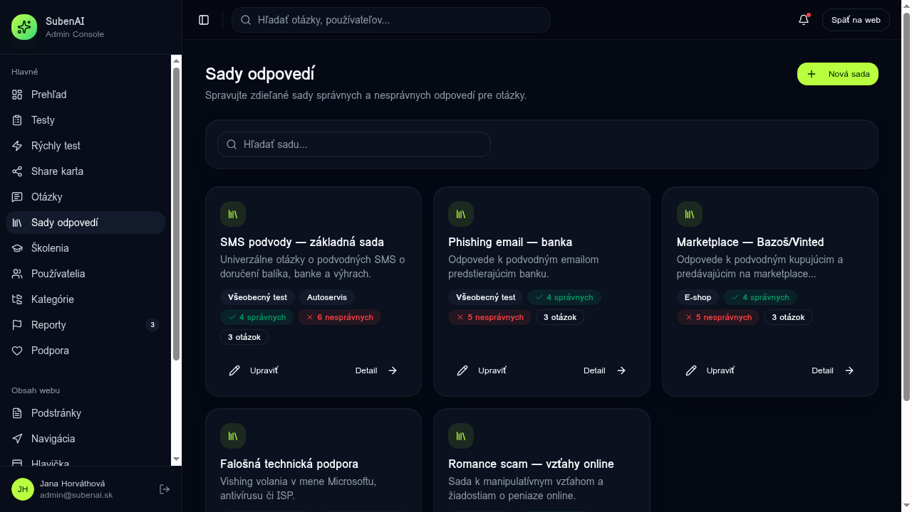
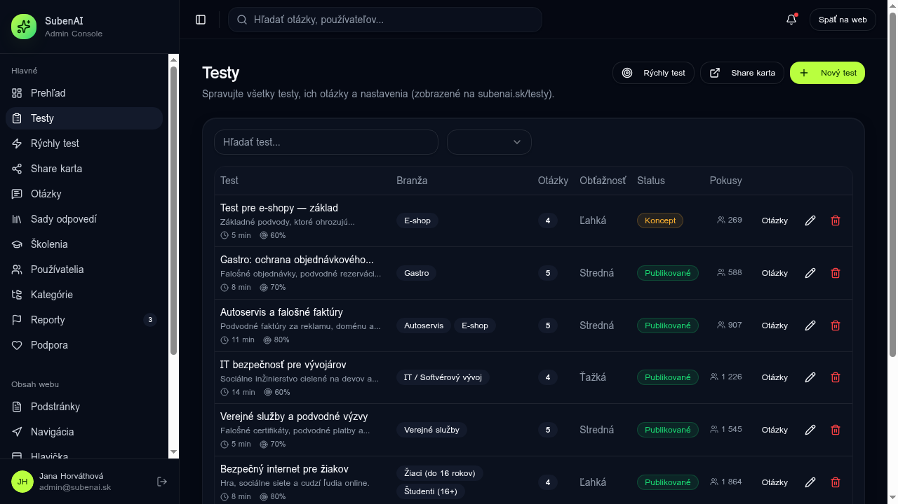
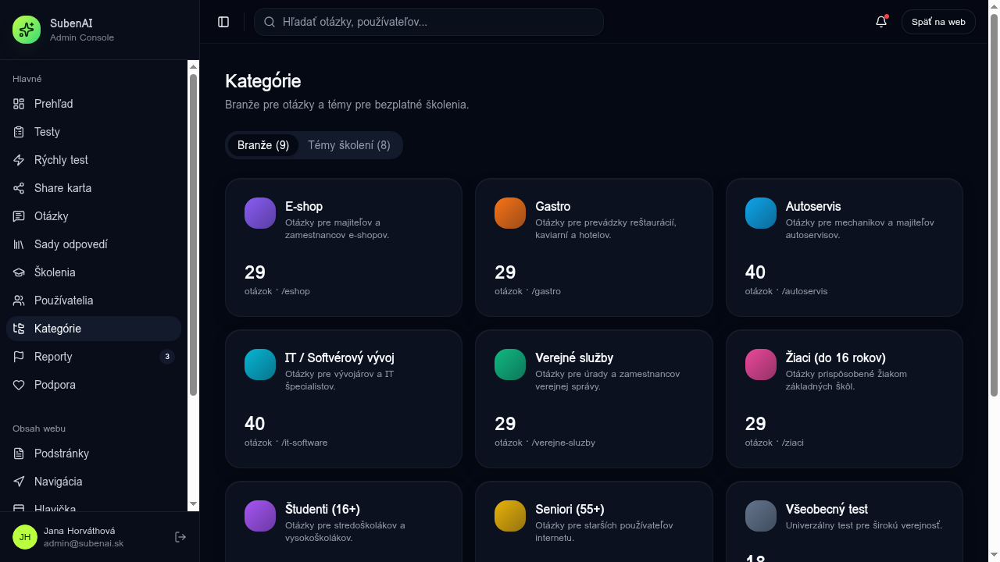

# ADMIN GUIDE — Admin panel (`/admin/*`)

Návod pre admin používateľa platformy SubenAI. Pre tvorcu testov → [USER_GUIDE.md](./USER_GUIDE.md).

---

## 1. Vstup do admin panela

Dve cesty:
1. Z užívateľskej aplikácie: `/app` → sidebar dole **„Admin platformy"** → `/admin`
2. Priamo: `http://localhost:5173/admin` (v MVP žiadna auth gate)

---

## 2. Dashboard (`/admin`)

**4 KPI karty**: Používatelia, Aktívni za 7d, Otázky, Otvorené reporty.
**Aktivita za 14 dní** (chart) a **Distribúcia kategórií** (donut).

**Sidebar — celá admin navigácia**:

| Sekcia | Route | Popis |
|---|---|---|
| **Hlavné** | | |
| Prehľad | `/admin` | KPI + charts |
| Testy | `/admin/tests` | CRUD všetkých testov platformy |
| Rýchly test | `/admin/quick-test` | Config rýchleho 1-otázkového testu |
| Share karta | `/admin/share-card` | Vizuálna karta na zdieľanie výsledkov |
| Otázky | `/admin/questions` | Knižnica + AI generátor |
| Sady odpovedí | `/admin/answer-sets` | Zdieľané sady správnych/nesprávnych odpovedí |
| Školenia | `/admin/trainings` | Edukačné mini-kurzy |
| Používatelia | `/admin/users` | CRUD; roly admin/moderator/user |
| Kategórie | `/admin/categories` | Vetvy + témy |
| Reporty | `/admin/reports` | Nahlásený obsah |
| Podpora | `/admin/support` | Email, hodiny |
| **Obsah webu** | | |
| Podstránky | `/admin/pages` | CMS sub-pages (`/s/$slug`) |
| Navigácia | `/admin/navigation` | Hlavná navigácia subenai.sk |
| Hlavička | `/admin/header` | Logo + nav |
| Pätička | `/admin/footer` | Kolóny, linky, socials |
| **Bezpečnosť** | | |
| Respondenti | `/admin/respondents` | PII prístup — vždy logovaný |
| Audit | `/admin/audit` | Read-only audit log |
| DSR | `/admin/dsr` | Queue GDPR žiadostí |
| Nastavenia | `/admin/settings` | Globálne settings (UI hotové) |

---

## 3. Správa otázok (`/admin/questions`)

**Stĺpce**: Otázka (+ autor + dátum) · Branža · Status · Aktivita (komenty / likes / reporty).

**Akcie:**
- 🟢 **Nová otázka** → otvorí `QuestionEditor` (modal)
  - Typ: `single` / `multi` / `scale_1_5` / `nps` / `matrix` / `ranking` / `slider` / `short_text` / `long_text` / `yes_no` / `image_choice` / `file_upload`
  - Vetva + kategória + ťažkosť
  - Voliteľne: link na **answer set** (zdieľaná sada správnych odpovedí)
- ⬇️ **Export** → JSON/CSV stiahnutie všetkých otázok
- ✏️ Ikona ceruzky na riadku → edit
- ⋯ Menu → duplicate / delete

**Statusy otázky**: `draft` · `pending` · `approved` · `published` · `flagged` · `deprecated` · `archived`.

### AI generátor

V hornej časti `QuestionEditor` je tlačidlo **„✨ AI generovať"** (komponent `AiQuestionGenerator`). Po enable Lovable Cloud → volá Lovable AI Gateway. Detaily → [INTEGRATION.md §3 krok 7](./INTEGRATION.md#krok-7-ai-generátor-otázok).

---

## 4. Sady odpovedí (`/admin/answer-sets`)

Sada = pomenovaná kolekcia správnych a nesprávnych odpovedí ktoré sa **zdieľajú medzi otázkami**. Napr. „SMS podvody — základná sada" sa použije v 5 podobných otázkach.

**Karta sady** ukazuje: branže, počet ✅ správnych, ❌ nesprávnych, koľko otázok ju používa.

**Akcie:**
- 🟢 **Nová sada** → modal: name, description, branže
- ✏️ **Upraviť** na karte → otvorí stránku detail
- **Detail →** `/admin/answer-sets/$setId` ukazuje:
  - 2 kolóny: **Správne** vs **Nesprávne** odpovede
  - Inline edit textu + vysvetlenia
  - Drag-to-reorder (position)
  - Tlačidlo **„Pridať odpoveď"** pre každú kolónu
  - Zoznam **otázok ktoré túto sadu používajú** (link na `/admin/questions`)

Persistence: všetko cez `adminRepo.answerSets.{list,get,create,update,delete}` v `src/lib/admin/store.ts`.

---

## 5. Testy (`/admin/tests`)

**Stĺpce**: Test (+ popis + ⏱ trvanie + 🎯 success rate) · Branža · Otázky · Obťažnosť · Status · Pokusy · Akcie.

**Akcie:**
- 🟢 **Nový test** → otvorí editor
- 📋 **Rýchly test** → presmerovanie na `/admin/quick-test`
- 🔗 **Share karta** → `/admin/share-card`
- **Otázky** na riadku → otvorí editor poradia otázok
- ✏️ → edit
- 🗑 → delete s `ConfirmDialog`

**Editor testu** (`/admin/tests/$testId`):
- Záložky: **Otázky** (drag-reorder) · **Nastavenia** (status, segmentácia, GDPR purpose) · **Verzia** (publish nová verzia)

---

## 6. Kategórie (`/admin/categories`)

Dva taby:
- **Branže** — kategórie otázok (E-shop, Gastro, Autoservis, IT, …). Slug sa používa vo `question.branch_slug`.
- **Témy školení** — kategórie pre `/admin/trainings`.

**Akcie:**
- 🟢 **Nová branža / téma** → modal: name, slug (auto), description, color (color picker)
- ✏️ Klik na kartu → edit modal
- 🗑 → delete (s confirm; chráni pred zmazaním ak je naviazaná na otázky)

Persistence: `adminRepo.categories.*` a `adminRepo.topics.*`.

---

## 7. Reporty (`/admin/reports`)

Zoznam nahláseného obsahu. Každý report má:
- **Reason**: `spam` / `inappropriate` / `harassment` / `misinformation` / `other`
- **Status**: `open` → `reviewing` → `resolved` / `dismissed`

Akcie (mení status v `adminRepo.reports.update`):
- **Review** — beriem si to
- **Resolve** — vyriešené (napr. zmazaná otázka)
- **Dismiss** — nesprávne nahlásenie

---

## 8. Audit log (`/admin/audit`)

Read-only stream. Každý záznam: actor, action, target, čas, **flag `pii_access`**.

**Filter**:
- Podľa actor (admin)
- Podľa action (`user.suspend`, `question.delete`, `respondent.view_pii`, …)
- Toggle „len PII prístupy"

V produkcii by sa toto malo zapisovať **server-side cez `supabaseAdmin`** — nikdy z klienta. Viď [INTEGRATION.md §3 krok 8](./INTEGRATION.md).

---

## 9. DSR queue (`/admin/dsr`)

GDPR žiadosti od userov (z `/app/legal/dsr`). Stĺpce:
- email žiadateľa
- typ (`access` / `erase` / `portability`)
- status (`open` / `in_progress` / `completed` / `rejected`)
- **SLA due** — 72h od submit; po prekročení sa svieti červené

Akcie: Start (→ in_progress), Complete, Reject (+ note).

---

## 10. CMS — verejný web

### `/admin/pages`
Zoznam podstránok zobrazených na `/s/$slug`. CRUD + status `draft` / `published`.

**Detail** `/admin/pages/$pageId`:
- SEO meta (title, description, og:image)
- Blocks editor (heading / paragraph / image / cta / faq)
- Publish → nastaví `published_at`

### `/admin/header`, `/admin/footer`, `/admin/navigation`
Singleton konfigurácie:
- Header: logo URL + nav items (label, href, externý/interný)
- Footer: kolóny (title + links) + socials (icon + url) + legal links
- Navigation: ordered nav items pre celý web

Všetko cez `cms-store.ts` + `cms-hooks.ts`.

---

## 11. Globálne settings (`/admin/settings`)

UI hotové, persistencia ešte hardcoded. TODO pred go-live:
- Default jazyk
- Brand farby (override design tokens)
- Email odosielateľa
- Feature flags

---

## Šľape to v produkcii?

Všetky CRUD akcie v admin panely v MVP zapisujú do **in-memory `adminRepo`**. Pri refreshe stránky sa resetujú na seed. Pre produkciu (Supabase + RLS):

→ pozri [INTEGRATION.md §3 krok 5](./INTEGRATION.md) — replace mock store za Supabase queries (`useQuery` + `useMutation`).
