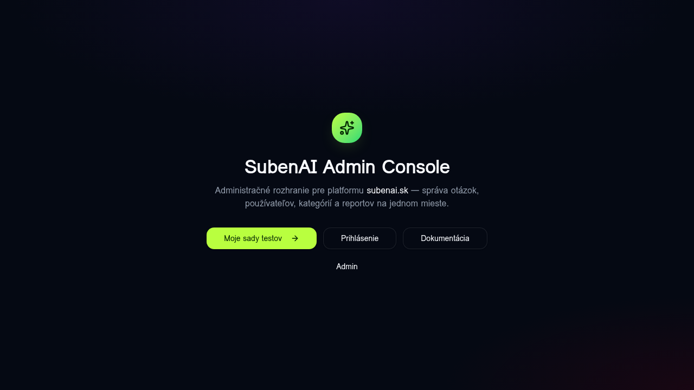
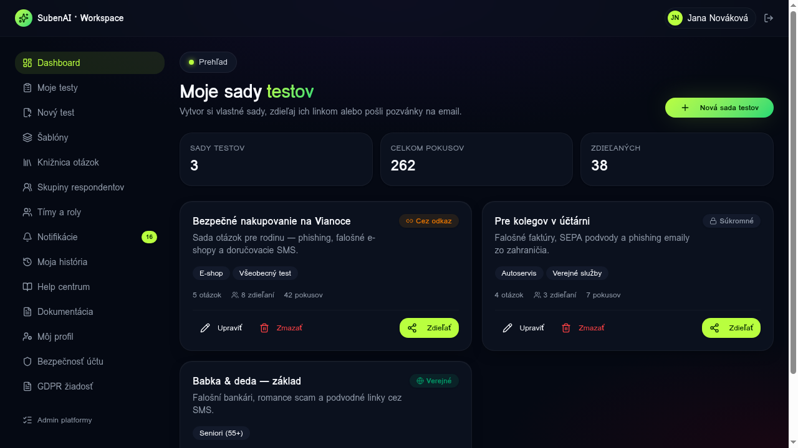
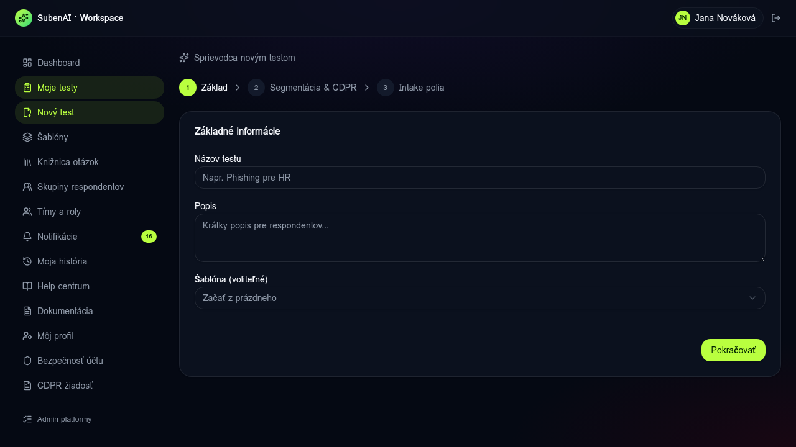

# USER GUIDE — Užívateľská aplikácia (`/app/*`)

Tento návod prevedie konečného používateľa (tvorcu testov) cez funkcie v `/app/*`. Pre admin sekciu → [ADMIN_GUIDE.md](./ADMIN_GUIDE.md).

---

## 1. Landing → vstup do aplikácie

1. Otvor `http://localhost:5173/`
2. Klikni na **„Moje sady testov"** → presmerovanie na `/app`
3. (Mock auth — žiadny login formulár neblokuje vstup)

---

## 2. Dashboard (`/app`)

**Čo tu vidíš:**
- **3 KPI karty** — počet sád testov, celkové pokusy, koľko ich je zdieľaných
- **Grid kariet** — všetky tvoje sady testov; každá karta má badge „Cez odkaz / Súkromné / Verejné", chip s kategóriou a 3 metriky (otázok / zdieľaní / pokusov)
- **Tlačidlá**: `Upraviť`, `Zmazať`, `Zdieľať` (otvorí ShareDialog)

**Sidebar (ľavá kolóna)** obsahuje všetky sekcie užívateľskej aplikácie:

| Sekcia | Route | Čo robí |
|---|---|---|
| Dashboard | `/app` | KPI + zoznam testov |
| Moje testy | `/app/tests` | Filter, search, status |
| Nový test | `/app/tests/new` | 3-krokový wizard |
| Šablóny | `/app/templates` | Preddefinované testy |
| Knižnica otázok | `/app/library` | Reusable questions pool |
| Skupiny respondentov | `/app/audiences` | Email cohorts + tagy |
| Tímy a roly | `/app/teams` | owner / editor / viewer |
| Notifikácie | `/app/notifications` | Filter podľa typu, mark read |
| Moja história | `/app/history` | Sessions a verzie |
| Help centrum | `/app/help` | FAQ accordion |
| Môj profil | `/app/account/profile` | Display name, avatar |
| Bezpečnosť účtu | `/app/account/security` | Heslo, 2FA |
| GDPR žiadosť | `/app/legal/dsr` | Submit DSR (access/erase/portability) |

---

## 3. Vytvorenie nového testu — wizard

Klik na **„Nový test"** v sidebare → 3-krokový wizard:

### Krok 1 — Základ
- **Názov testu** (povinné)
- **Popis** (zobrazí sa respondentovi pred štartom)
- **Šablóna** (voliteľné — vyber preddefinovanú alebo začni z prázdneho)

### Krok 2 — Segmentácia & GDPR
- **Segmentácia** — koho test cieli (Seniori, Žiaci, Verejnosť, …)
- **GDPR účel** — `marketing` / `research` / `recruitment` / `education` / `internal_training`
- **Anonymizovať po N dňoch** (voliteľné) — automaticky vymaže prepojenie na respondenta

### Krok 3 — Intake polia
- Voliteľné polia ktoré sa pýtame respondenta pred testom (email, vek, lokalita)
- Pri každom poli flag **`pii: true/false`** — určuje, či sa pri admin prístupe loguje do audit log

Po dokončení wizardu → presmerovanie na `/app/tests/$testId` kde môžeš pridávať otázky, nastaviť zdieľanie atď.

---

## 4. Zdieľanie testu

Na ľubovoľnom teste klik **Zdieľať** → otvorí sa `ShareDialog`:

- **Public link** — `https://subenai.sk/t/$shareId` (respondent ide bez prihlásenia)
- **Heslo** (voliteľné) — pred testom sa pýta heslo
- **Expirácia** (voliteľné)
- **QR kód** pre share na papieri / prezentácii
- Zoznam pozvaných **respondent groups** (z `/app/audiences`)

---

## 5. Notifikácie

`/app/notifications` ukazuje:
- nové session completed
- nové reporty na tvoju otázku
- pozvánka do tímu
- pripomienka DSR žiadosti (72h SLA)

Filter podľa typu (info / success / warning / error) + bulk mark-as-read.

---

## 6. GDPR — DSR žiadosti

`/app/legal/dsr` — user si môže požiadať o svoje dáta:

| Typ | Popis |
|---|---|
| **Access** | Zoznam všetkých session ktoré user spravil + intake data |
| **Erase** | Anonymizácia (respondent_id → null vo všetkých sessions) |
| **Portability** | JSON export podľa GDPR čl. 20 |

Žiadosť ide do admin queue `/admin/dsr` so SLA 72h.

---

Ďalej → [ADMIN_GUIDE.md](./ADMIN_GUIDE.md) pre admin panel.
